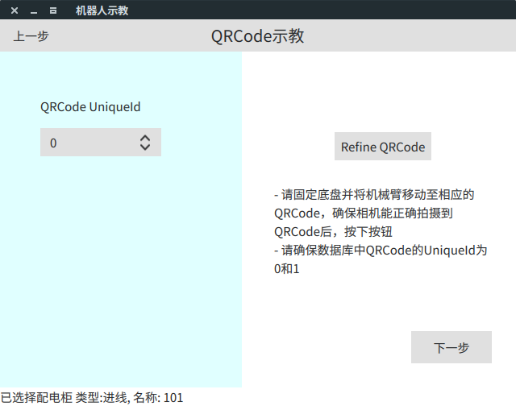

# 可视化示教工具文档

## 编译

### 编译依赖

- Qt 5.13.0

### 编译步骤

- 下载　Qt 5.13.0
- 在`CMakeList.txt`中设置`QT5_13_PATH`, 须精确到`gcc_64`文件夹
- 将本工程放入一个catkin workspace中
- `catkin_make`

### 常见编译问题

- 编译报错

  ```[bash]
  CMake Warning at mmrobot_teach_tool_gui/CMakeLists.txt:24 (find_package):
  Could not find a configuration file for package "Qt5" that exactly matches
  requested version "5.13.0".
  ```

  该问题由`QT5_13_PATH`设置错误所致，导致cmake无法找到5.13.0版本的Qt, 另外一定确保`QT5_13_PATH`中最后一级目录为`gcc_64`文件夹

- 编译成功，运行报错

  ```[bash]
  qt.qpa.plugin: Could not find the Qt platform plugin "xcb" in ""
  This application failed to start because no Qt platform plugin could be initialized. Reinstalling the application ma
  ```

  该问题由cmake链接至了错误的qt版本所致，重新下载Qt5.13.0并正确设置`QT5_13_PATH`

### 使用方法

- **登录**
  - 确保使用具有修改权限的MySQL账号
  - 待修改的数据库table在源码中固定为`Power_distribution_room`，如有需要，请至`login.qml`中修改

    
- **Home**
  - 选择修改数据库或者机器人示教

    

- **修改数据库**

  - **选择配电柜种类**

    
    - 可在左边选择已有的配电柜类型，该列表可上下滚动
    - 也可在右边新建配电柜类型， TypeID将会自动分配

  - **选择配电柜名称**

    
    - 根据上一步选择的配电柜类型，左侧列出了数据库中存在的所有属于该类型的配电柜，可直接点击进入下一步
    - 若新建配电柜，
      - 可直接在右侧输入配电柜名称后新建，其所有属性将为默认值或null, 之后将需要手动填充
      - 或者可以现有配电柜作为模板，勾选“以现有开关柜作为模板” （结果如下图所示）， 然后填充必要的信息后点击新建。新建的配电柜除了name, qrcode内容以外，所有属性与模板配电柜一致。

        
    - 新建后的配电柜将在左侧显示，仍需在左侧点击后才能进入下一步
    - 下方footbar显示了当前的选择

  - **选择配电柜元件**

    
    - 左侧选择待修改的元件， 右侧可添加新的元件
    - **注意**:
      - QRCode的UniqueID**只能**为0和1，且0和1**只能**为QRCode （程序会提示错误）
      - 同一配电柜的元件的UniqueID**不可**重复 (程序会提示错误）

  - **修改元件属性**

    
    - **注意**：
      - 如无特殊情况，涉及到距离的属性同一使用**毫米(mm)**作为单位
      - `qx`, `qy`, `qz`,`qw`填写完后请点击`归一化四元数`
      - sql中还存在其他属性，但是一般无需变动

- **示教**
  
  **注意**: 该示教程序**仅**向相应的rostopic发送消息以作为示教指令，具体的执行效果以相应节点命令行反馈为准，本示教程序**无反馈信息**

  **注意**: `VisualSafeWrapperTeachNode` 具有示教能力，`VisualSafeWrapperNode`无示教能力

  - **配电柜位置示教**

    
    - 可仅选择配电柜种类、ID后直接进入下一步
    - 若需示教配电柜位置
      - 请确保`mm_robot_decision`中的`record_node.py`节点已开启
      - 左侧选择配电柜种类、ID后在右侧点击`示教配电柜位置`
      - 检查`record_node.py`输出，若正常后点击进入下一步

  - **关节角示教**

    
    - 可仅选择元件后进入下一步，元件名称后紧跟的数字为其相应的UniqueID
    - 若需示教关节角
      - 请确保`mm_robot_decision`中的`record_node.py`节点已开启
      - 左侧选择元件后在右侧点击`记录关节角位置`
      - 检查`record_node.py`输出，若正常后点击进入下一步

  - **初始化配电柜**

    
    - **该步骤必须完成，不可跳过**
    - 请确保`mm_visual_postion` 中的 `VisualSafeWrapperTeachNode`已开启， 并且机械臂节点、相机节点已启动
    - 先点击`移动至QRCode0`发送指令移动机械臂至QRCode0的拍摄位置
    - 确保抵达后 点击定位`QRCode0`
    - 再点击`移动至QRCode1`发送指令移动机械臂至QRCode1的拍摄位置
    - 确保抵达后 点击定位`QRCode1`
    - 观察各节点输出，一切正常后点击下一步
  
  - **QRCode示教**

    
    - 该步骤将自动精确矫正选择的QRCode的位置以及高度宽度，并写入数据库
    - 可直接点击下一步跳过
    - 若需示教QRCode
      - 请确保`mm_visual_postion` 中的 `VisualSafeWrapperTeachNode`已开启并已经过初始化
      - 左侧选择QRCode UniqueID后在右侧点击`Refine QRCode`
      - 检查`VisualSafeWrapperTeachNode`输出，若正常点击进入下一步

  - **Offset示教**

    
    - 该步骤将精确矫正各Object的实际位置与拍摄位置之间的距离， 该offset由末端工具安装误差、视觉系统误差等引入
    - QRCode可免于该步骤示教
    - 可直接点击下一步跳过该步骤
    - 若需示教Offset
      - 请确保`mm_visual_postion` 中的 `VisualSafeWrapperTeachNode`已开启并已经过初始化
      - 左侧选择元件的 UniqueID后在右侧点击`移动至初始位置`
      - 等待机械臂移动至拍摄位置，检查`VisualSafeWrapperTeachNode`输出
      - 确保移动到位后，利用手操板手动移动机械臂至正确的操作位置
      - 点击`保存offset`
      - 检查`VisualSafeWrapperTeachNode`输出，若正常点击进入下一步

  - **采集数据**

    
    - 该步骤用于采集开关状态识别、指示灯状态识别所需的训练数据，采集数据默认保存与`mm_visual_postion/datasets`下
    - **注意：同一配电柜统一元件采集多次数据将会被覆盖**, 因此若需重复采集，请每次采集完后手动更改已保存的数据的文件夹名称
    - 若需采集
      - 请确保`mm_visual_postion` 中的 `VisualSafeWrapperTeachNode`已开启并已经过初始化
      - 左侧选择待采集的元件，名称后紧跟的数字为其UniqueID 
      - 右侧点击`开始采集数据`并注意观察`VisualSafeWrapperTeachNode`输出
